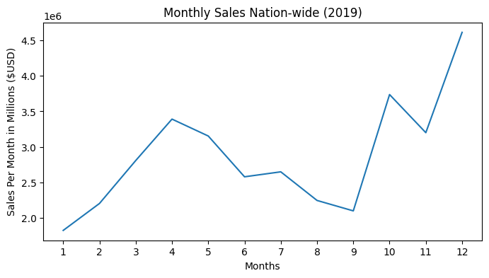
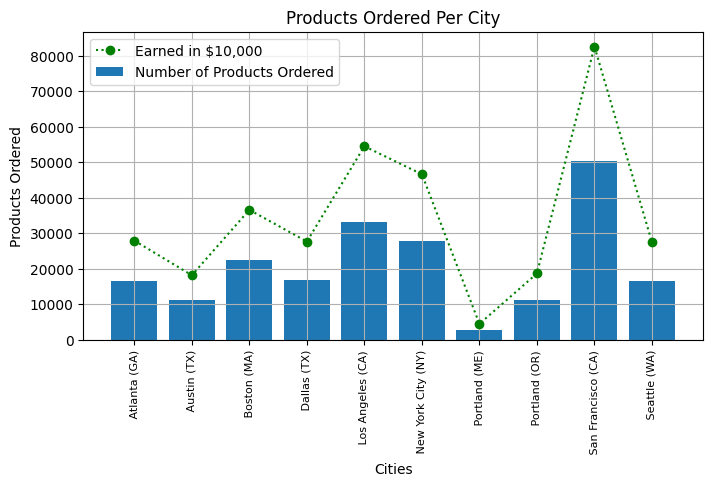
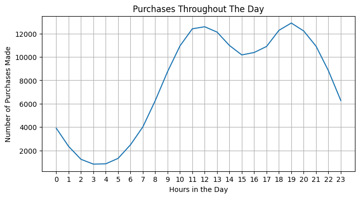
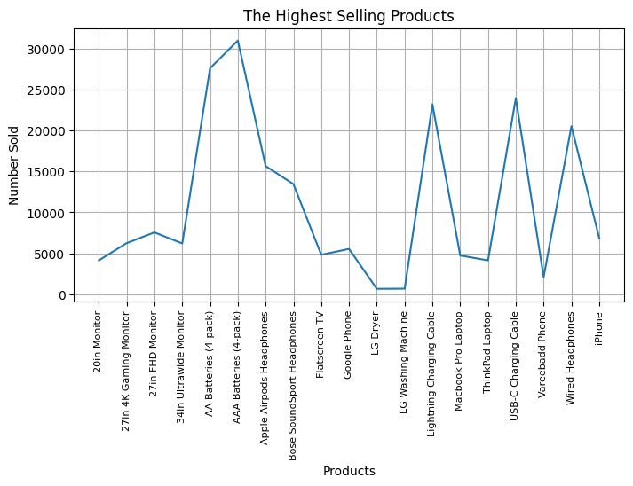
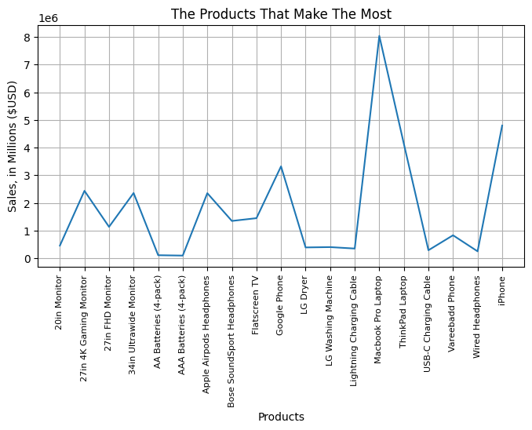

# An Analysis of Online Store Customers

## The Dataset

Dataset provided courtesy of [Keith Galli](https://github.com/KeithGalli/Pandas-Data-Science-Tasks)

The dataset consists of sales data for the year 2019. The data includes items purchased, how many of each, for what price, as well as the date, time, and purchase location of the online purchases made. In order to adequately clean this data, null values needed to be removed. Additionally, the dataset included rows that only held the name of each column reiterated throughout the dataset numerous times for the sake of readability. The final, cleaned dataset consists of roughly 190,000 rows of data.

---

## The Questions Addressed

#### **Question 1:** *What month is the best for sales, and how much was earned in that month?*

Based on the dataset, the best month for sales is **December**. This is likely due to the occurrence of Christmas during the month of December -- the largest shopping holiday in the United States, annually. Additionally, sales spiked in April and again in October. These spikes are not so easily described by national holidays, considering the items purchased are not seasonal or festive (i.e. candy sales in October would be more easily explainable).

As shown in Figure 1, sales in December top out at just over $4.5 Million (USD). 

---

#### **Question 2:** *Which city is responsible for the most sales?*

The best city in terms of number of items sold, as well as total money earned in sales, is **San Fransisco, CA**. The reasoning for this may be due to the overall population in San Fransisco, the high frequency of technical work that may require more expensive products such as laptops, the average income within Silicon Valley that allows for more spending, and more. Similarly, Figure 2 shows that the cities that sold the most products earned the most income, and vice versa. This can help conclude that no city in this dataset is buying any more expensive products, but fewer products in total, than any other city.

---

#### **Question 3:** *What time should we display advertisements to maximize the likelihood of customers buying products?*

**Answer:** The best time to show ads is **during either 12:00 pm or 11:00 pm**, as these are the times that the most orders are placed. This will increase the chances of ads being seen, as this is the time that the most active users are interacting with the website.

Figure 3 shows the activity level in greater detail.

---

#### **Question 4:** *Which items are most frequently purchased together in a single order?*

**Answer:** The products that are most commonly purchased together are the products that in some way interact with one another. This includes things like iPhones and Lightning charging cables, Google Phones and USB-C charging cables, etc.

The following table provides the top 5 sets of products that are most commonly purchased together:

| Product 1 | Product 2 | Instances of Being Purchased Together |
| --- | --- | --- |
| iPhone | Lightning Charging Cable | 1005 |
| Google Phone | USB-C Charging Cable | 987 |
| iPhone | Wired Headphones | 447 |
| Google Phone | Wired Headphones | 414 |
| Vareebadd Phone | USB-C Charging Cable | 361 |

Additionally, this table reflects the popularity of certain devices, such as the iPhone and the Google Phone. While close in number, there are slightly more iPhone-related purchases occurring than Google Phone-related purchases. This reflects the overall prevalence and popularity of iPhone devices in the smartphone market.

---

#### **Question 5:** *Which items are most frequently purchased from the online store?*

**Answer:** The items that sell the most in sheer quantity are **AA and AAA batteries, as well as charging cables**. These items actually have quite a bit in common that helps them to be the most frequently sold -- they're cheap and relatively disposable. Batteries need to be replaced regularly, and it's not uncommon for individuals to have multiple charging cables, or to require a replacement cable should one get lost or damaged. 

These items are also significantly cheaper than other, more permanent products such as phones, computers, etc. Since this question is particularly concerned with how many of each product is purchased, it makes sense that the products that are cheap and often have to be replaced sell the most frequently. Figure 5 shows this relationship in greater detail.

---

#### **Question 6:** *Which items make the store the most money?*

**Answer:** Though the figure above may show they're not purchased very frequently compared to other items, the product that generates the most revenue is the **MacBook Pro Laptop**. This product is responsible for a drastically large percentage of the store's overall sales. When compared to the most frequently purchased, yet cheapest products -- AA and AAA batteries -- we can see that those products generate hardly any revenue for the store.

Interestingly enough, the product that sold the least in Question 5 (the LG Washer and Dryer) also accounts for some of the lowest monetary sales. Perhaps this is due to better alternatives, pricing, or perhaps the appeal of a washer and dryer as opposed to a MacBook Pro or Phone. It may also have something to do with the lifespan of a product such as a washer or dryer, requiring very infrequently replacement or upgrade in its entirety. This is an interesting result that could use further exploration.

---

## Follow-Up Questions and Next Steps

Though this is a good start, there exist many follow-up questions of a similar nature that could be beneficial to the website that this dataset originated from. These questions include:

<ul>
  <li>Insights Per City</li>
    <ul>
      <li> Can we further analyze the demographic or economic factors in the city with the highest sales to understand why it outperforms other cities?</li>
      <li> Are there opportunities for expanding business operations in the top-performing city or replicating successful strategies in other locations?</li>
    </ul>
    
  <li>Optimizating Advertisements
    <ul>
      <li>Can we delve deeper into user interaction data to identify more specific time slots for displaying ads, such as weekdays vs. weekends or morning vs. evening?</li>
      <li>Are there correlations between ad timing and the type of products being purchased?</li>
    </ul>
  </li>
    
  <li>Inventory Management</li>
    <ul>
      <li>Develop predictive models to forecast demand for different items. This can help in optimizing inventory levels and reducing costs.</li>
      <li>Implement strategies like Just-In-Time (JIT) inventory management to reduce excess stock.</li>
    </ul>
      
  <li>Competitor Analysis</li>
      <ul>
          <li>Investigate the competitive landscape in the industry. Are there competitors whose strategies or products are affecting sales?</li>
          <li>Monitor the market for emerging trends or competitors that could impact future sales.</li>
    </ul>
</ul> 

    

